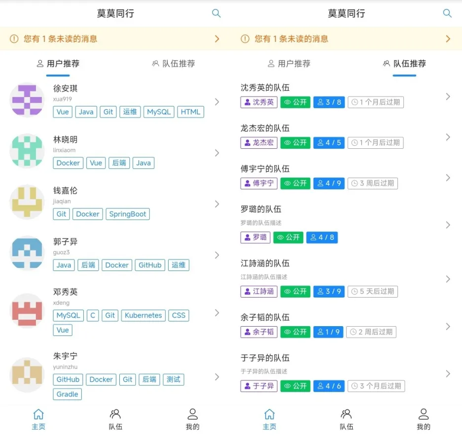
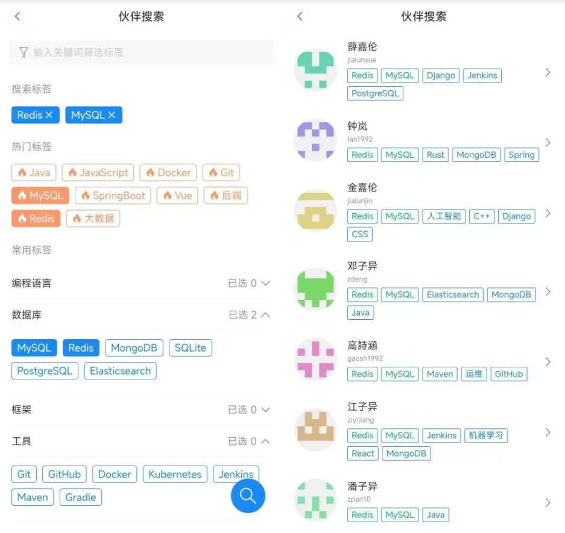
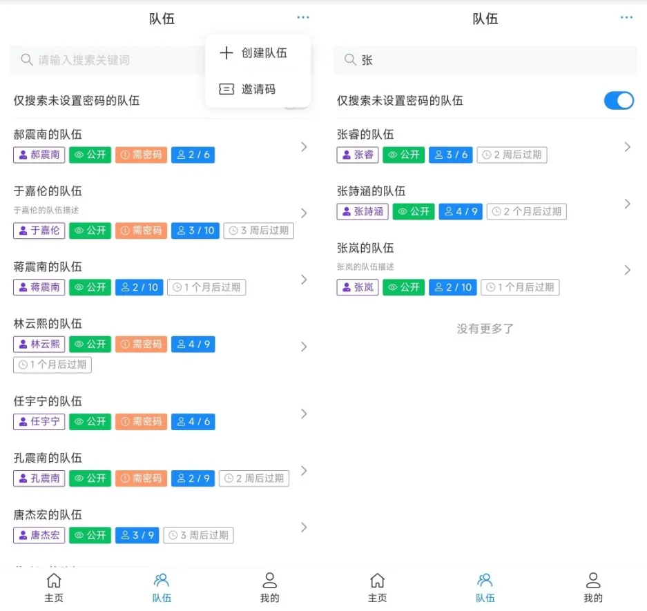
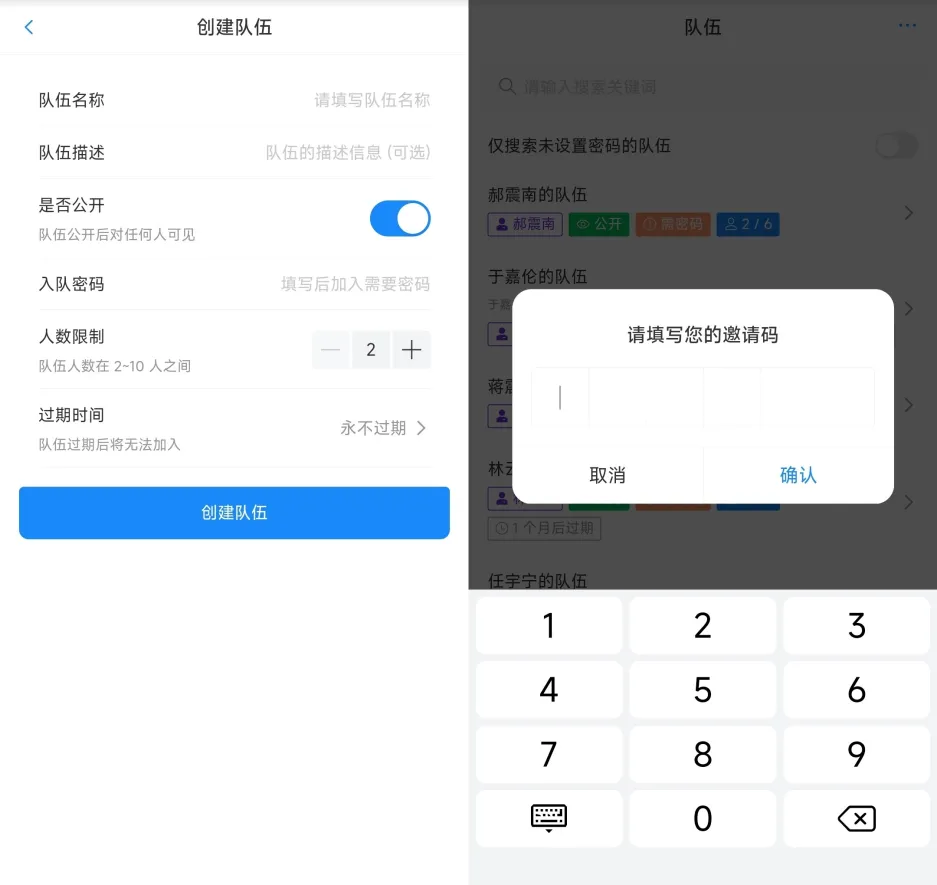
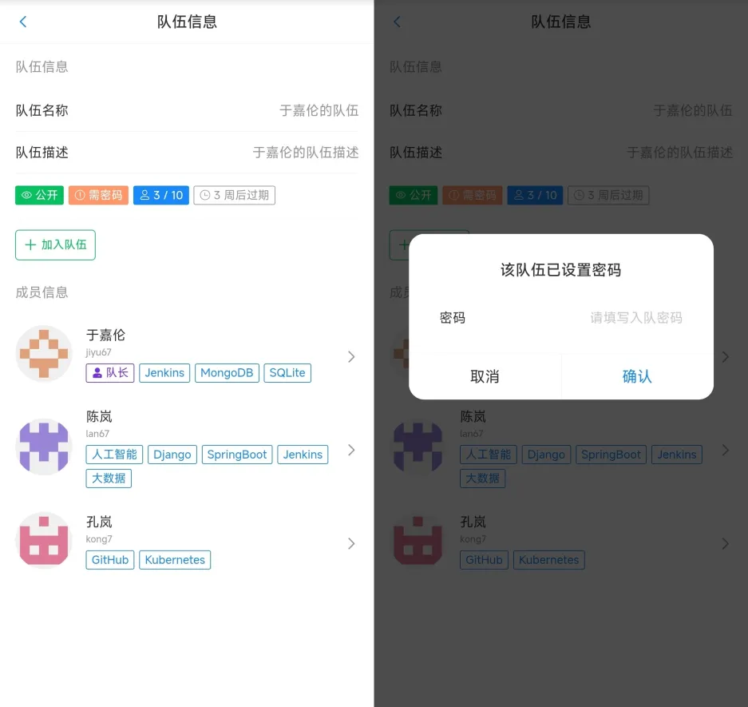
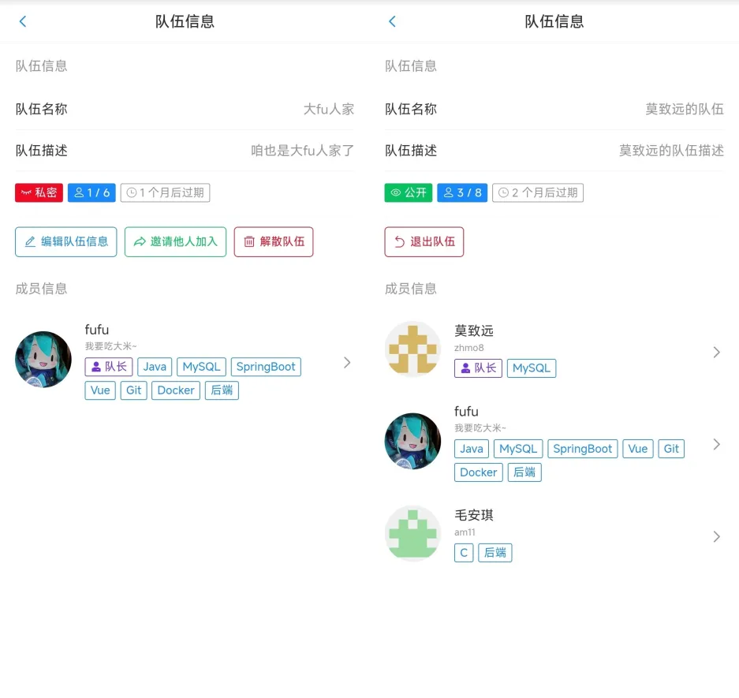
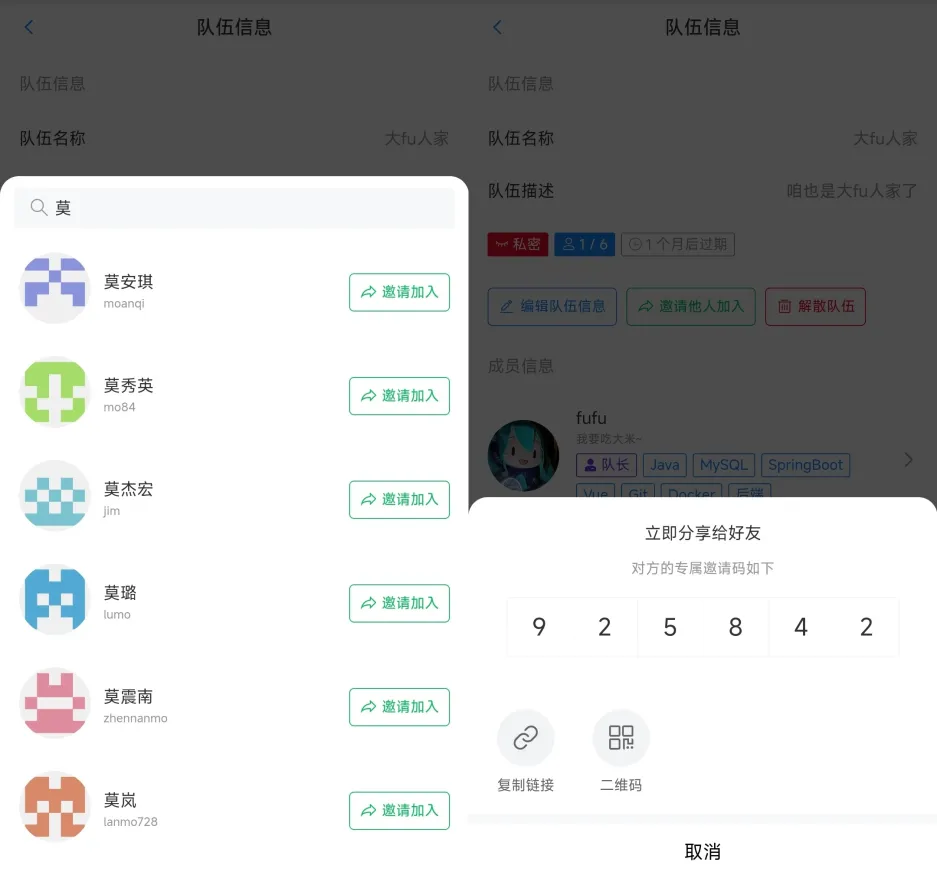
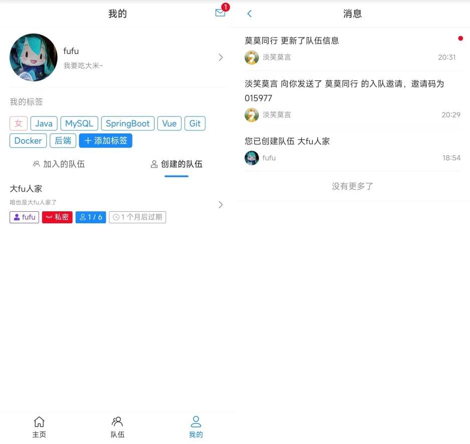
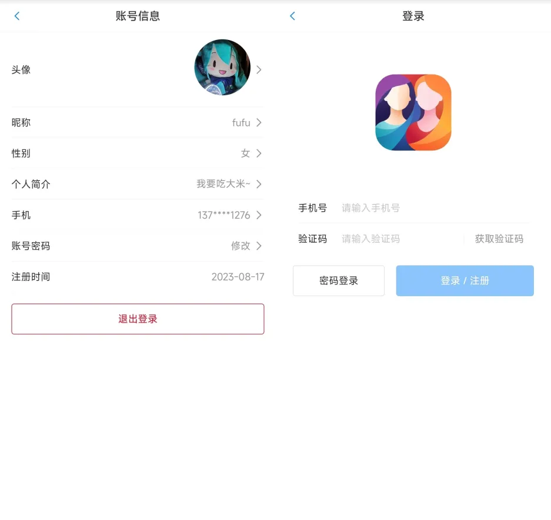

# 需求分析

1. 给用户添加标签, 标签的分类 (需要有那些标签、怎么把标签进行分类) ,  学习方向 [ 前端 / 后端 / C++ / ... ]
2. 主动搜索: 允许用户根据标签搜索其他用户
    1. 缓存 [ Redis ] + 本地缓存
3. 组队
    1. 创建队伍
    2. 加入队伍
    3. 根据标签查询队伍
    4. 邀请其它人加入你的队伍
4. 允许用户去修改标签
5. 推荐
    1. 相似度计算的算法 + 本地分布式计算

# 技术选型说明

## 前端技术栈

### 1. Vue 3

采用 **Vue 3** 作为前端开发框架，提供灵活高效的开发体验，同时利用其强大的响应式数据绑定和组件化开发，显著提高开发效率。
**官方文档**: [Vue.js 官方文档](https://cn.vuejs.org/guide/introduction.html)

### 2. Vant 4

集成 **Vant 4** 作为移动端 UI 组件库，提供轻量级且可定制的组件，满足移动端界面开发需求，提升用户体验。
**官方文档**: [Vant 4 官方文档](https://vant-ui.github.io/vant/#/zh-CN)

### 3. Vite

利用 **Vite** 作为构建工具，拥有极速的冷启动性能、按需编译模块以及现代化的开发体验，极大提高项目开发和构建效率。
**官方文档**: [Vite 官方文档](https://cn.vitejs.dev/)

### 4. Nginx

通过 **Nginx** 进行单机部署，提供高效的静态资源服务，并支持负载均衡与反向代理，为系统的稳定性和性能提供保障。

------

## 后端技术栈

### 1. Java

采用 **Java** 作为后端开发语言，凭借其丰富的生态系统和稳定性，为项目构建高效、健壮的业务逻辑层。

### 2. Spring Framework

通过 **Spring Framework** 提供依赖注入和组件管理能力，简化 Java 对象生命周期管理，同时实现与其他框架的无缝集成。

### 3. Spring MVC

使用 **Spring MVC** 作为 Web 框架，支持 RESTful 接口设计，提供灵活的路由和参数处理机制，满足多样化接口需求。

### 4. MyBatis

采用 **MyBatis** 框架对数据库操作进行封装，以其灵活性和简洁性在复杂查询场景下表现优异。

### 5. MyBatis-Plus

集成 **MyBatis-Plus**，通过其提供的 CRUD 接口，进一步提升开发效率，减少重复代码编写，快速实现持久层功能。

### 6. Spring Boot

选择 **Spring Boot** 作为后端应用的基础框架，简化配置和依赖管理，快速启动和集成项目组件，减少开发复杂度。

### 7. MySQL

使用 **MySQL** 关系型数据库作为主要数据存储解决方案，凭借其性能优越性和强大的查询能力支持复杂的数据操作需求。

### 8. Redis

集成 **Redis** 作为分布式缓存服务，提升系统的数据访问性能，同时支持分布式锁、消息队列等高级功能，优化系统性能。

### 9. Swagger + Knife4j

通过 **Swagger** 与 **Knife4j** 生成可视化 API 文档，提供简洁直观的接口说明与调试能力，方便开发与测试环节的对接。

## 数据库表设计（待完善）

```sql
# 数据库初始化
# @author stephen qiu
#

-- 创建库
create database if not exists popcorn;

-- 切换库
use popcorn;

-- 用户表
create table user
(
    id           bigint auto_increment comment 'id'
        primary key,
    userAccount  varchar(256)                           not null comment '账号',
    userPassword varchar(512)                           not null comment '密码',
    userName     varchar(256)                           null comment '用户昵称',
    userGender   int          default 2                 null comment '用户性别（0-男 ，1-女，2-保密）',
    userPhone    varchar(256)                           null comment '手机号码',
    userAvatar   varchar(1024)                          null comment '用户头像',
    userProfile  varchar(512)                           null comment '用户简介',
    userRole     varchar(256) default 'user'            not null comment '用户角色：user/admin/ban',
    userEmail    varchar(256)                           null comment '用户邮箱',
    tags         varchar(1024)                          null comment '标签列表',
    createTime   datetime     default CURRENT_TIMESTAMP not null comment '创建时间',
    updateTime   datetime     default CURRENT_TIMESTAMP not null on update CURRENT_TIMESTAMP comment '更新时间',
    isDelete     tinyint      default 0                 not null comment '是否删除'
)
    comment '用户' collate = utf8mb4_unicode_ci;

create table tag
(
    id         bigint auto_increment comment 'id'
        primary key,
    tagName    varchar(256)                       not null comment '标签名称',
    userId     bigint                             not null comment '用户id',
    parentId   bigint                             null comment '父标签id',
    isParent   tinyint  default 0                 null comment '0-不是父标签，1-是父标签',
    createTime datetime default CURRENT_TIMESTAMP not null comment '创建时间',
    updateTime datetime default CURRENT_TIMESTAMP not null on update CURRENT_TIMESTAMP comment '更新时间',
    isDelete   tinyint  default 0                 not null comment '是否删除'
)
    comment '标签表';

-- 队伍表
create table team
(
    id           bigint auto_increment comment 'id'
        primary key,
    teamName     varchar(256)                       not null comment '队伍名称',
    teamProfile  varchar(1024)                      null comment '队伍简介',
    coverImage   varchar(256)                       null comment '队伍图标',
    expireTime   datetime                           null comment '队伍过期时间',
    userId       bigint                             not null comment '创建人id',
    status       tinyint                            not null comment '队伍状态（0-公开,1-私密,2-需要密码）',
    teamPassword varchar(256)                       null comment '队伍密码',
    createTime   datetime default CURRENT_TIMESTAMP not null comment '创建时间',
    updateTime   datetime default CURRENT_TIMESTAMP not null comment '更新时间',
    isDelete     tinyint  default 0                 not null comment '是否删除'
)
    comment '队伍表';

-- 队伍-用户表
create table team_user
(
    id         bigint auto_increment comment 'id'
        primary key,
    userId     bigint                             not null comment '用户id',
    teamId     bigint                             not null comment '队伍id',
    joinTime   datetime default CURRENT_TIMESTAMP not null comment '加入时间',
    createTime datetime default CURRENT_TIMESTAMP not null comment '创建时间',
    updateTime datetime default CURRENT_TIMESTAMP not null comment '更新时间',
    isDelete   tinyint  default 0                 not null comment '是否删除'
)
    comment '队伍-用户表';
```

# 项目 UI 图展示

















